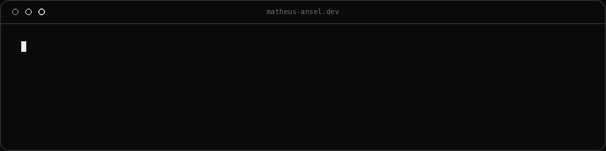

  

# Hi, I'm Matheus Ansel

### Full Stack Developer

Systems Analysis and Development graduate from UNISUAM focused on backend engineering, scalable APIs, cloud applications and modern web development.

---

# Tech Stack

  

  
  

" />

# PROJETOS EM DESTAQUES ABAIXO!

